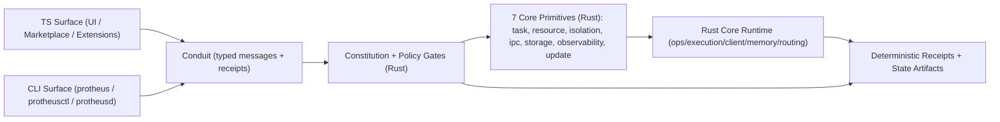

# Protheus Architecture

Protheus is built as a Rust-first kernel (trusted core) with a narrow conduit to TypeScript surfaces.

## InfRing Direction

InfRing is the target operating model: a portable autonomous substrate that runs unchanged across desktop, server, embedded, and high-assurance profiles.

- Rust kernel remains the single source of truth.
- Conduit is the only TS <-> Rust bridge.
- TS is reserved for flexible surfaces (UI, marketplace, extensions, experimentation).

## System Map

## Runtime Flow

1. A command enters from CLI or a TS surface.
2. Conduit normalizes the command into a typed envelope.
3. Rust policy/constitution checks evaluate fail-closed.
4. Rust primitives execute deterministic logic.
5. Crossing + validation receipts are emitted for auditability.

## Portability Contract

- With TS present: conduit-backed orchestration and rich operator surfaces.
- Without TS: Rust core still runs with no kernel behavior drift.

## Related Docs

- [Getting Started](client/docs/GETTING_STARTED.md)
- [Conduit Requirement](client/docs/requirements/REQ-05-protheus-conduit-bridge.md)
- [Rust Primitive Requirement](client/docs/requirements/REQ-08-rust-core-primitives.md)
- [Security Posture](client/docs/SECURITY_POSTURE.md)
