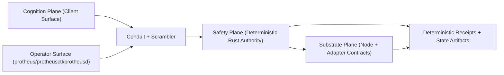

# Protheus Architecture

Protheus is built as a Rust-first kernel (trusted core) with a narrow conduit to TypeScript surfaces.

Canonical architecture contract:
- `docs/SYSTEM-ARCHITECTURE-SPECS.md` (Conscious/Subconscious Iceberg Specification v1.0)

## InfRing Direction

InfRing is the target operating model: a portable autonomous substrate that runs unchanged across desktop, server, embedded, and high-assurance profiles.

- Rust kernel remains the single source of truth.
- Conduit is the only TS <-> Rust bridge.
- TS is reserved for flexible surfaces (UI, marketplace, extensions, experimentation).

## Three-Plane Metakernel

Protheus is explicitly modeled as a substrate-independent metakernel with three planes:

1. Safety plane (`planes/safety`, implemented in `core/layer0..2`): deterministic authority for policy, isolation, scheduling, receipts, and fail-closed execution.
2. Cognition plane (`planes/cognition`, implemented in `client/`): probabilistic model orchestration, retrieval, planning, persona overlays, and user-facing cognition surfaces.
3. Substrate plane (`planes/substrate`): runtime/backend descriptors for CPU/MCU/GPU/NPU/QPU/neural channels with explicit degradation contracts.

Hard boundary:
- AI can propose; kernel authority decides.
- Client <-> core communication is conduit + scrambler only.
- Every substrate must declare fallback/degradation behavior.

Formal contract surfaces:
- Boundary/formal specs: `planes/spec/`
- Inter-plane contract schemas: `planes/contracts/`

## Conscious vs Subconscious Split (Iceberg Model)

Protheus follows an explicit iceberg contract:

- Subconscious runtime (hidden engine) lives in `core/` and owns scoring, priority, policy, escalation, and fail-closed authority.
- Conscious runtime (cockpit surface) lives in `client/` and consumes core outputs through conduit only.
- The cockpit can observe and render importance metadata; it cannot compute or override authority decisions.

Driver analogy:

- `core/` is the drivetrain, brakes, and stability control.
- `client/` is the steering wheel, dashboard, and infotainment.
- Conduit is the harness between them.

REQ-27 authority implementation:

- Importance scoring engine: `core/layer0/ops/src/importance.rs`
- Priority ordering + queue metadata: `core/layer0/ops/src/attention_queue.rs`
- Layer2 initiative primitives (score/action/priority queue shaping): `core/layer2/execution/src/initiative.rs`
- Regression guard (no subconscious authority in client): `client/systems/ops/subconscious_boundary_guard.ts`

Migration note:
- Strictly follow Protheus Conscious/Subconscious Iceberg Specification v1.0 — subconscious code only in core/ layers with upward-only flow.
- Existing `layer0/ops` authority lanes remain active while Layer2-only ownership is completed incrementally without runtime regressions.

## Filesystem Mapping (Authoritative)

| Plane | Contract Location | Implementation Location | Mutable Runtime Location |
|---|---|---|---|
| Safety | `planes/safety/` | `core/layer0/`, `core/layer1/`, `core/layer2/` | `core/local/` |
| Cognition | `planes/cognition/` | `client/` (`systems`, `lib`, `config`, `packages`, `tools`, `tests`) | `client/local/` |
| Substrate | `planes/substrate/` | Core adapters in `core/layer0/` + substrate lane surfaces in `client/systems/` | `core/local/` + `client/local/` |

Additional split rules:

- Source of truth code: `core/` and `client/` only.
- Runtime/user/device/instance data: `client/local/` and `core/local/` only.
- Legacy compatibility links are disabled by default. Canonical runtime roots are direct:
  - `client/local/*` for client runtime data
  - `core/local/*` for core runtime data

## Direct Wiring Policy

- Deprecated compat surfaces (`client/state`, root `state/`, root `local/`) are not valid runtime paths.
- Client wrappers must call core through conduit/scrambler only; no policy authority exists in TS compatibility shells.
- Migration tooling may provide one-time compatibility options, but defaults are direct to canonical roots.
- Canonical path constants are centralized in:
  - TS: `client/lib/runtime_path_registry.ts`
  - Rust (conduit): `core/layer2/conduit/src/runtime_paths.rs`

## Conversation Eye (Default)

`conversation_eye` is a default cognition-plane sensory collector:

- Collector source: `client/adaptive/sensory/eyes/collectors/conversation_eye.ts`
- Synthesizer: `client/systems/sensory/conversation_eye_synthesizer.ts`
- Bootstrap/auto-provision: `client/systems/sensory/conversation_eye_bootstrap.ts`

Provisioning contract:

- Every `local:init` run auto-ensures `conversation_eye` exists in the eyes catalog.
- Runtime synthesis output is written to `client/local/state/memory/conversation_eye/nodes.jsonl`.
- Synthesized nodes are tagged with the conversation taxonomy:
  `conversation`, `decision`, `insight`, `directive`, `t1`.

Conversation hierarchy additions:

- Synthesized nodes now include leveled memory metadata:
  - `node1` (highest), `tag2`, `jot3` (lowest)
- Nodes include deterministic hex IDs and XML-style payload boundaries for low-cost parsing.
- Weekly node admission is quota-bound (10/week default) with bounded level-1 promotion overrides.

## Dream Sequencer + Auto Recall (Memory Integrity)

Memory relevance is continuously reordered through a dream-cycle sequencer:

- Matrix builder: `client/systems/memory/memory_matrix.ts`
- Sequencer runner: `client/systems/memory/dream_sequencer.ts`
- Auto recall lane: `client/systems/memory/memory_auto_recall.ts`

Contracts:

- Tag-memory matrix stores every indexed tag with ranked node IDs and scores.
- Scoring combines memory level (`node1>tag2>jot3`), recency, and dream inclusion signals.
- Dream cycle runs trigger sequencer reorder passes and emit updated ranked tags.
- New memory filings can trigger bounded top-match recall pushes to attention queue through conduit only.

Context guard:

- `memory_recall` query path enforces a hard context budget contract:
  - `--context-budget-tokens` (default `8000`, floor `256`)
  - `--context-budget-mode=trim|reject`
- Trim mode reduces excerpt/summaries to fit budget; reject mode fails closed with `context_budget_exceeded`.

## Low-Burn Reflexes

Client cognition exposes a compact reflex set for frequent operations under strict output caps:

- Registry/runner: `client/reflexes/index.ts`
- Reflexes: `read_snippet`, `write_quick`, `summarize_brief`, `git_status`, `memory_lookup`
- Each reflex response is capped at `<=150` estimated tokens.

## Why Root Is Clean

Repository root is intentionally reduced to:

- source roots (`core/`, `client/`, `planes/`)
- governance and product docs (`README.md`, `ARCHITECTURE.md`, `SRS.md`, `TODO.md`)
- build/deploy metadata (`Cargo.toml`, `package.json`, lockfiles, CI/deploy manifests)

All high-churn runtime artifacts are localized to `client/local/` and `core/local/` so:

- source diffs stay reviewable
- sensitive/user-specific state is easier to reset or ignore
- open-source client surface can be published without leaking instance data

`planes/` is the living architectural contract surface. If code and docs diverge, `planes/*` + this file define the expected target state.

## System Map

## Runtime Flow

1. A command enters from CLI or a TS surface.
2. Conduit normalizes the command into a typed envelope.
3. Safety plane policy/constitution checks evaluate fail-closed.
4. Safety authority schedules deterministic execution against substrate adapters.
5. Cognition outputs are treated as probabilistic inputs unless authorized by safety policy.
6. Crossing + validation receipts are emitted for auditability.

## Portability Contract

- With TS present: conduit-backed orchestration and rich operator surfaces.
- Without TS: Rust core still runs with no kernel behavior drift.

## Related Docs

- [Getting Started](client/docs/GETTING_STARTED.md)
- [Conduit Requirement](client/docs/requirements/REQ-05-protheus-conduit-bridge.md)
- [Rust Primitive Requirement](client/docs/requirements/REQ-08-rust-core-primitives.md)
- [Security Posture](client/docs/SECURITY_POSTURE.md)
- [Three-Plane Model](planes/README.md)
- [Three-Plane Formal Spec Surface](planes/spec/README.md)
- [Planes Contract Registry](planes/contracts/README.md)
- [Layer Rulebook](client/docs/architecture/LAYER_RULEBOOK.md)
