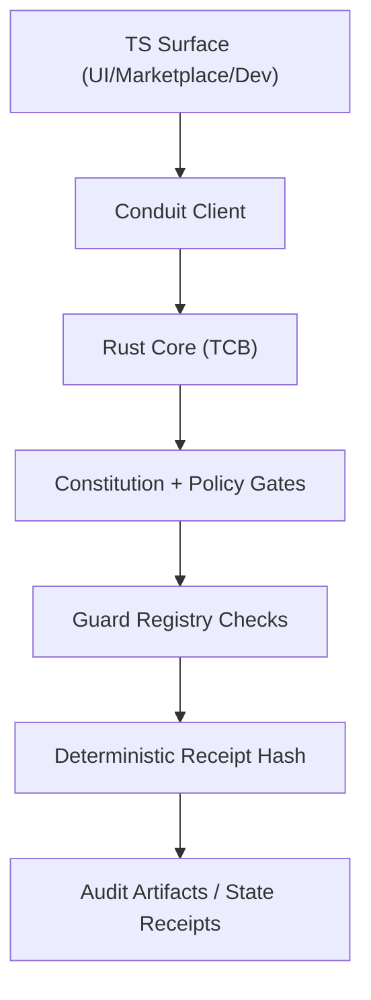

# Protheus Security Posture

Version: 1.0  
Date: 2026-03-06  
Owner: Protheus Core Security

## Scope

This document describes the current security architecture for Protheus with Rust as the kernel source of truth and TypeScript constrained to client/dev-facing surfaces via conduit boundaries.

## Threat Model

Primary threats:
- policy bypass attempts at TS-to-Rust boundaries
- supply-chain tampering in dependencies and release artifacts
- unauthorized mutation of runtime policy/config state
- cross-lane privilege escalation and command abuse
- integrity drift in governance/security contracts

Defensive posture:
- fail-closed policy and constitution checks in Rust
- deterministic claim-evidence receipts on critical runtime/security lanes
- signed/runtime-attested guard surfaces
- explicit least-authority command routing through conduit
- guard registry enforcement on every protected merge path

## Claim-Evidence Security Architecture



## Conduit Security Guarantees

- Rust owns validation and policy decisions (`core/layer2/conduit`, `core/layer2/conduit-security`).
- Message signing, capability tokens, and rate limiting are enforced in Rust.
- Command budget is bounded by policy and validated fail-closed.
- TS wrappers do not own kernel truth paths.

## Current Security Systems (83 Active Checks)

Source: `client/config/guard_check_registry.json` (`merge_guard.checks`)

Evidence-linked inventory:
- `client/docs/security/SECURITY_LAYER_INVENTORY.md` (generated by `node client/systems/ops/security_layer_inventory_gate.js run --strict=1 --write=1`)

1. `contract_check`
2. `integrity_kernel_check`
3. `skin_protection_verify`
4. `schema_contract_check`
5. `adaptive_layer_guard_strict`
6. `memory_layer_guard_strict`
7. `workspace_dump_guard_strict`
8. `conflict_marker_guard`
9. `repo_hygiene_guard_strict`
10. `dist_runtime_legacy_pairs`
11. `js_holdout_audit_strict`
12. `formal_invariant_engine`
13. `critical_path_formal_verifier`
14. `supply_chain_trust_plane`
15. `key_lifecycle_verify`
16. `post_quantum_migration_status`
17. `quantum_security_synthesis_status`
18. `docs_coverage_gate`
19. `dr_gameday_gate`
20. `simplicity_budget_gate`
21. `causal_temporal_graph_build`
22. `emergent_primitive_synthesis_status`
23. `hardware_embodiment_parity`
24. `resurrection_protocol_status`
25. `value_anchor_renewal_status`
26. `explanation_primitive_status`
27. `gated_self_improvement_status`
28. `iterative_repair_primitive_status`
29. `interactive_desktop_session_status`
30. `doctor_forge_micro_debug_status`
31. `full_virtual_desktop_claw_status`
32. `account_creation_profile_extension_status`
33. `delegated_authority_status`
34. `world_model_freshness_status`
35. `continuous_chaos_resilience_status`
36. `error_budget_release_gate`
37. `critical_path_policy_coverage`
38. `backlog_intake_quality_gate`
39. `composite_disaster_gameday_status`
40. `self_hosted_bootstrap_status`
41. `surface_budget_controller_status`
42. `compression_transfer_plane_status`
43. `opportunistic_offload_plane_status`
44. `phone_seed_profile_status`
45. `client_relationship_manager_status`
46. `gated_account_creation_status`
47. `capital_allocation_organ_status`
48. `economic_entity_manager_status`
49. `drift_aware_revenue_optimizer_status`
50. `siem_bridge_status`
51. `soc2_type2_track_status`
52. `predictive_capacity_forecast_status`
53. `neural_dormant_seed_check`
54. `pre_neuralink_interface_status`
55. `execution_sandbox_envelope_status`
56. `organ_state_encryption_verify`
57. `remote_tamper_heartbeat_verify`
58. `operator_terms_ack_status`
59. `secure_heartbeat_endpoint_verify`
60. `repository_access_auditor_status`
61. `secret_rotation_migration_status`
62. `helix_baseline_status`
63. `helix_admission_status`
64. `helix_confirmed_malice_status`
65. `redteam_ant_colony_status`
66. `profile_compatibility_gate`
67. `schema_evolution_contract`
68. `state_kernel_status`
69. `state_kernel_parity`
70. `state_kernel_replay_verify`
71. `state_kernel_cutover_status`
72. `state_kernel_dual_write_status`
73. `dynamic_burn_budget_oracle_status`
74. `rust_memory_benchmark_consistency`
75. `rust_memory_daemon_supervisor_healthcheck`
76. `cognitive_control_primitive_status`
77. `dynamic_memory_embedding_adapter_status`
78. `memory_index_freshness_gate`
79. `trajectory_skill_distiller_status`
80. `motivational_state_vector_status`
81. `agent_settlement_extension_status`
82. `source_attestation_extension_status`
83. `test_ci`

## Operational Verification Commands

```bash
cargo run --quiet --manifest-path core/layer0/ops/Cargo.toml --bin protheus-ops -- enterprise-hardening run --strict=1
NODE_PATH=$PWD/node_modules npm run -s formal:invariants:run
cargo run --quiet --manifest-path core/layer0/ops/Cargo.toml --bin protheus-ops -- benchmark-matrix run --refresh-runtime=1
```

## Release Security Artifacts

- CycloneDX SBOM generated on tagged releases (`v*`) by workflow:
  - `.github/workflows/release-security-artifacts.yml`
- CodeQL static analysis:
  - `.github/workflows/codeql.yml`
- Dependency update automation:
  - `.github/dependabot.yml`
